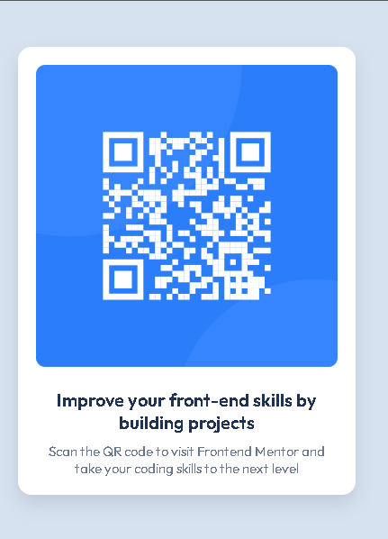

# Frontend Mentor - QR code component solution

This is a solution to the [QR code component challenge on Frontend Mentor](https://www.frontendmentor.io/challenges/qr-code-component-iux_sIO_H). Frontend Mentor challenges help you improve your coding skills by building realistic projects. 

## Table of contents

- [Overview](#overview)
  - [Screenshot](#screenshot)
  - [Links](#links)
- [My process](#my-process)
  - [Built with](#built-with)
  - [What I learned](#what-i-learned)
  - [Continued development](#continued-development)
  - [Useful resources](#useful-resources)
- [Author](#author)
- [Acknowledgments](#acknowledgments)

## Overview

This project is a simple, responsive QR code component. It includes a QR code image and text encouraging users to scan the code and visit Frontend Mentor. The component is designed with responsiveness in mind, ensuring a clean and structured display on both mobile and desktop devices.

### Screenshot



### Links

- Solution URL: [Click here](https://nkululekocyrilcele.github.io/QR-Code-Component/)
- Live Site URL: [Click here](https://nkululekocyrilcele.github.io/QR-Code-Component/)

## My process

### Built with

- **Semantic HTML5 markup**: All elements use semantic HTML tags to enhance accessibility.
- **Custom CSS**: The design uses pure CSS with custom styles to handle layout, typography, and responsiveness.
- **Flexbox**: Used for centering the component both vertically and horizontally in the viewport.
- **Mobile-first workflow**: The design prioritizes mobile devices first and scales up for larger screens using media queries.

### What I learned

This project helped reinforce the importance of semantic HTML and how to manually recreate commonly used Bootstrap features using pure CSS. I wanted to avoid using a heavy CSS framework and focused on making my code as clean and maintainable as possible.

Here's a key section of the CSS that mimics Bootstrap's flexbox layout:

```css
.container {
  display: flex;
  justify-content: center;
  align-items: center;
  height: 100vh;
}
```

I also learned how to balance card styling with responsiveness by writing media queries to ensure the design looks good on mobile and desktop:

```css
@media (min-width: 768px) {
  .qr-card {
    max-width: 350px;
  }
}

@media (min-width: 1200px) {
  .qr-card {
    max-width: 375px;
  }
}
```

### Continued development

Going forward, I plan to focus on improving my CSS organization by experimenting with methodologies like BEM (Block, Element, Modifier) and improving accessibility with better ARIA attributes.

### Useful resources

- [MDN Web Docs - Flexbox](https://developer.mozilla.org/en-US/docs/Learn/CSS/CSS_layout/Flexbox) - This guide helped me better understand flexbox and its practical uses for layout and alignment.
- [CSS Tricks - CSS Flexbox Layout Guide](https://css-tricks.com/snippets/css/a-guide-to-flexbox/) - A detailed explanation of how flexbox works, which was crucial for centering the card in the viewport.

## Author

- Nkululeko Cyril Cele
- Frontend Mentor - [@NkululekoCyrilCele](https://www.frontendmentor.io/profile/NkululekoCyrilCele)

## Acknowledgments
A special thanks to the Frontend Mentor community for the inspiration while building this solution.
